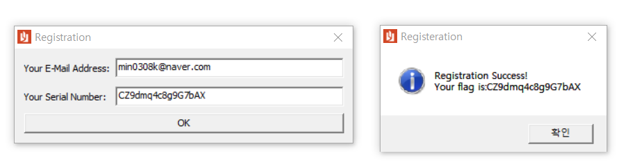

probs are from 


https://github.com/N4NU/Reversing-Challenges-List


[Baby probs]

-------------------------------------

dMd

```python
import hashlib
def fixstr(a):
    return a.encode('utf8')
def md5(s):
    return hashlib.md5(fixstr(s)).hexdigest()
if md5("b781cbb29054db12f88f08c6e161c199")=="780438d5b6e29db0898bc4f0225935c0":
    print("valid key")
else:
    print("invalid key")
```
key:b781cbb29054db12f88f08c6e161c199

-----

SRM

```python
from z3 import *
arr=[Int("arr%i"%i) for i in range(16)]
s=Solver()
s.add(arr[0] == 67)
s.add(arr[15] == 88)
s.add(arr[1] == 90)
s.add(arr[1] + arr[14] == 155)
s.add(arr[2] == 57)
s.add(arr[2] + arr[13] == 155)
s.add(arr[3] == 100)
s.add(arr[12] == 55)
s.add(arr[4] == 109)
s.add(arr[11] == 71)
s.add(arr[5] == 113)
s.add(arr[5] + arr[10] == 170)
s.add(arr[6] == 52)
s.add(arr[9] == 103)
s.add(arr[7] == 99)
s.add(arr[8] == 56)
print(s.check())
m=s.model()
flag=""
for i in range(len(arr)):
	flag+=chr(int(str(m.evaluate(arr[i]))))
print(flag)
```
key:CZ9dmq4c8g9G7bAX
slyfizz3.github.io/image/Rev-chall/Baby/


-----
